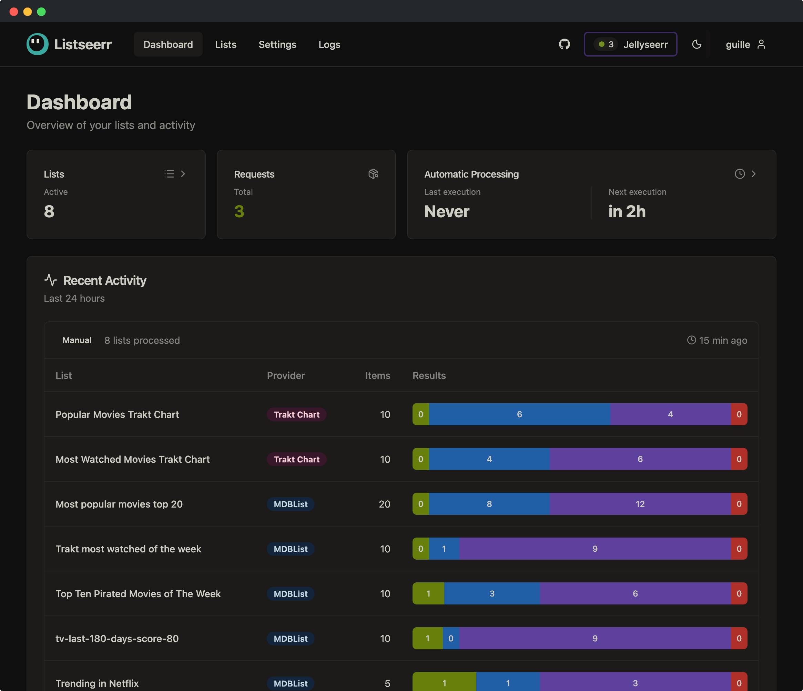
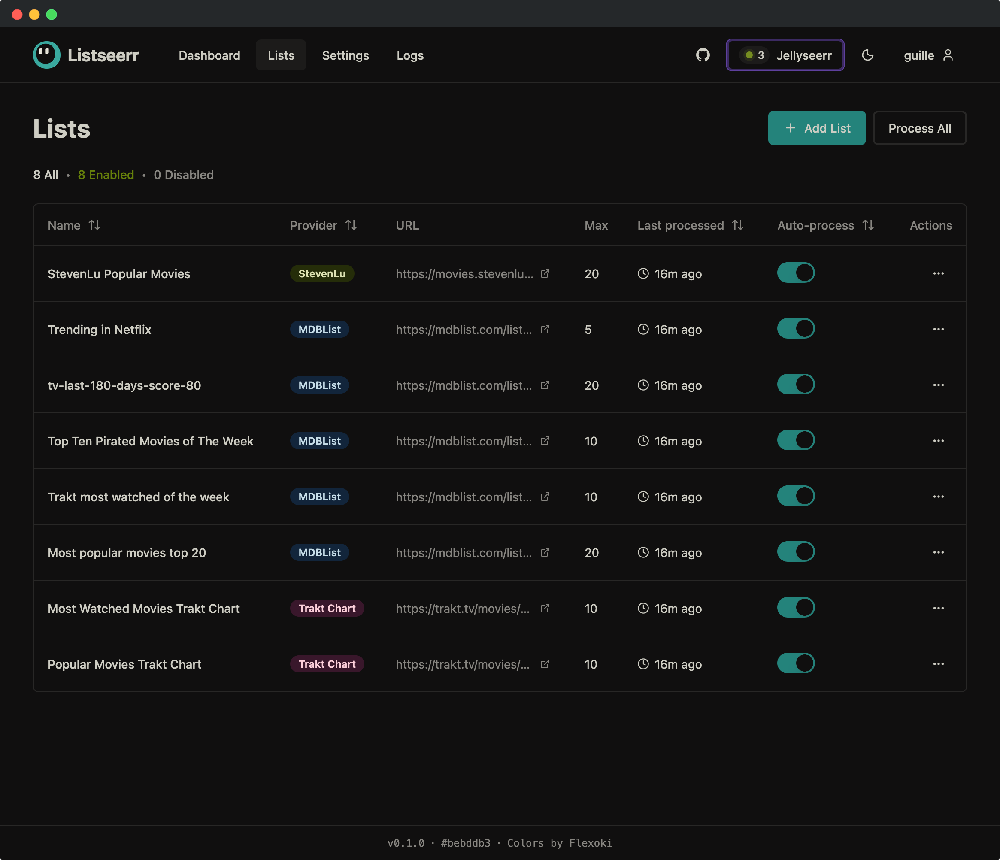

<div align="center">

<picture>
  <source media="(prefers-color-scheme: dark)" srcset="docs/icons/listseerr-dark.png">
  <source media="(prefers-color-scheme: light)" srcset="docs/icons/listseerr-light.png">
  
</picture>

# Listseerr

**Request movies & shows in Jellyseerr/Overseerr from your favorite lists**

[](https://github.com/guillevc/listseerr/actions/workflows/ci.yaml)
[](https://github.com/guillevc/listseerr/releases)
[](https://ghcr.io/guillevc/listseerr)
[](https://ko-fi.com/guillevc)

<p>
  <a href="docs/screenshots/dashboard.png"></a>
  <a href="docs/screenshots/lists.png"></a>
</p>

[See more screenshots →](docs/screenshots)

</div>

## 🧩 How It Works

```
┌──────────┐     ┌───────────┐         ┌───────────┐     ┌───────────┐
│  Trakt   │◀────│           │         │           │     │   *arr    │
├──────────┤     │           │ request │ Jellyseerr│────▶│   stack   │
│ StevenLu │◀────│ Listseerr │────────▶│           │     └───────────┘
├──────────┤     │           │         └───────────┘
│  MDBList │◀────│           │               ▲
├──────────┤     └───────────┘               │ approve
│  More... │◀────┘                     ┌─────┴─────┐
└──────────┘                           │   User    │
                                       └───────────┘
```

1. **Listseerr fetches media from your lists** — Connect your favorite curated lists from Trakt, MDBList, StevenLu, and more
2. **Requests are sent to Jellyseerr/Overseerr** — Movies and shows from your lists are automatically requested
3. **You review and approve** — Requests appear in Jellyseerr/Overseerr for you to approve (create a dedicated user without auto-approve permissions to review before downloading)
4. **Your \*arr stack downloads the media** — Once approved, Sonarr/Radarr handle the rest

Listseerr skips media that was previously rejected or is already available, so you won't see duplicate requests. Set it up once and let it run on a schedule.

## 🚀 Quick Start

### 1. Create a `compose.yaml`

```yaml
services:
  listseerr:
    image: ghcr.io/guillevc/listseerr:latest
    container_name: listseerr
    ports:
      - 3000:3000
    environment:
      TZ: 'UTC'
      # (REQUIRED) Generate with: openssl rand -hex 32
      ENCRYPTION_KEY: ''
    volumes:
      - ./data:/app/data
    restart: unless-stopped
```

Remember to include the `ENCRYPTION_KEY` environment variable, which has no default value.

### 2. Run the container

```bash
docker compose up -d
```

### 3. Start adding lists

Open [http://localhost:3000](http://localhost:3000) and create your account.

## ⚙️ Configuration

| Variable         | Description                                        | Default (Docker)         |
| ---------------- | -------------------------------------------------- | ------------------------ |
| `ENCRYPTION_KEY` | **Required.** Generate with `openssl rand -hex 32` | —                        |
| `PORT`           | Server port                                        | `3000`                   |
| `DATABASE_PATH`  | Path to SQLite database                            | `/app/data/listseerr.db` |
| `LOG_LEVEL`      | Logging level (`debug`, `info`, `warn`, `error`)   | `info`                   |
| `TZ`             | Timezone (IANA format)                             | `UTC`                    |

Override defaults via Docker environment variables.

## 🔗 Supported Providers

| Provider                | Status       | Requirements                                        |
| ----------------------- | ------------ | --------------------------------------------------- |
| **Trakt**               | ✅ Supported | [Free API key](https://trakt.tv/oauth/applications) |
| **MDBList**             | ✅ Supported | [Free API key](https://mdblist.com/preferences/)    |
| **StevenLu**            | ✅ Supported | None                                                |
| **StevenLu variations** | 🗓️ Planned   | None                                                |
| **IMDB**                | 🗓️ Planned   | —                                                   |
| **Letterboxd**          | 🗓️ Planned   | —                                                   |
| **TheMovieDB**          | 🗓️ Planned   | —                                                   |

Listseerr uses official APIs for reliable integration and faster processing.

**Want another provider?** [Request or vote here](https://github.com/guillevc/listseerr/discussions/1)

## 🔑 Password Recovery

**Docker:**

```bash
docker exec -it listseerr bun /app/dist/reset-password.js
```

**Local:**

```bash
bun run password:reset
```

## 🗺️ Roadmap

- [x] Multiple provider support (Trakt, MDBList, StevenLu)
- [x] Scheduled automatic processing
- [x] Dark/Light theme
- [x] Docker support
- [ ] More list providers
- [ ] Notifications

Have an idea? [Open an issue](https://github.com/guillevc/listseerr/issues/new)

## 💜 Support

If Listseerr is useful to you, consider supporting its development:

[](https://ko-fi.com/guillevc)

## 🤝 Acknowledgments

- Color scheme: [Flexoki](https://stephango.com/flexoki) by Steph Ango
- Inspired by the amazing self-hosted community

## 📄 License

[MIT](LICENSE)
