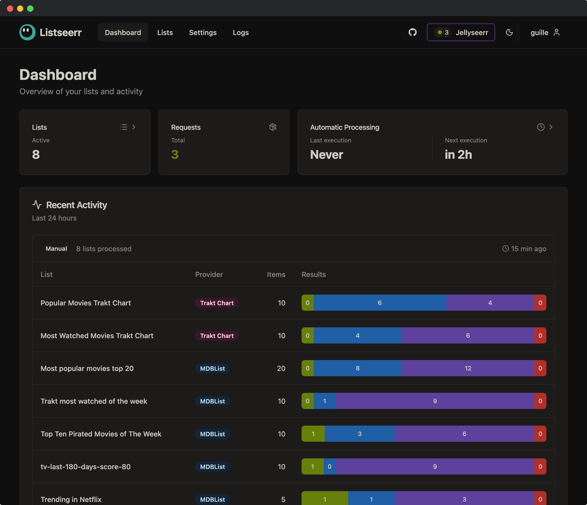
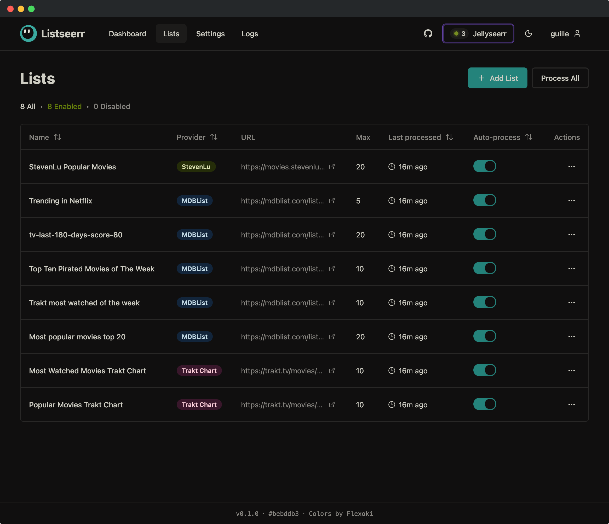

<div align="center">

<picture>
  <source media="(prefers-color-scheme: dark)" srcset="docs/icons/listseerr-dark.png">
  <source media="(prefers-color-scheme: light)" srcset="docs/icons/listseerr-light.png">
  
</picture>

# Listseerr

**Sync curated movie & TV show lists to Seerr as automated requests.**

[](https://github.com/guillevc/listseerr/actions/workflows/ci.yaml)
[](https://github.com/guillevc/listseerr/releases)
[](https://ghcr.io/guillevc/listseerr)
[](https://ko-fi.com/guillevc)

<p>
  <a href="docs/screenshots/dashboard.png"></a>
  <a href="docs/screenshots/lists.png"></a>
</p>

[More screenshots →](docs/screenshots)

</div>

## 🧩 Overview

Listseerr bridges the gap between list providers (Trakt, MDBList, etc.) and your request manager (Seerr). Point it at your favorite curated lists, and it will automatically create requests for every movie and show — on a schedule, hands-free.

Filtering and curation stay where they belong: in the list provider. Listseerr focuses on doing one thing well — syncing lists to requests.

```
┌──────────┐     ┌───────────┐         ┌───────────┐     ┌───────────┐
│  Trakt   │◀────│           │         │           │     │   *arr    │
├──────────┤     │           │ request │           │────▶│   stack   │
│ StevenLu │◀────│ Listseerr │────────▶│   Seerr   │     └───────────┘
├──────────┤     │           │         │           │
│  MDBList │◀────│           │         └───────────┘
├──────────┤     └───────────┘               ▲
│  AniList │◀────┘                           │ approve
└──────────┘                           ┌─────┴─────┐
                                       │   User    │
                                       └───────────┘
```

**How it works:** Listseerr fetches media from your lists → creates requests in Seerr → you review and approve → your \*arr stack downloads the media. Previously rejected or already-available media is automatically skipped.

> **Tip:** Create a dedicated Seerr user without auto-approve permissions so you can review requests before anything gets downloaded.

## 🔗 Supported Providers

| Provider                         |   Status   | Requirements                                        |
| :------------------------------- | :--------: | :-------------------------------------------------- |
| [Trakt](https://trakt.tv)        |     ✅     | [Free API key](https://trakt.tv/oauth/applications) |
| [MDBList](https://mdblist.com)   |     ✅     | [Free API key](https://mdblist.com/preferences/)    |
| [StevenLu](https://stevenlu.com) |     ✅     | None                                                |
| [AniList](https://anilist.co)    |     ✅     | None                                                |
| StevenLu variations              | 🗓️ Planned |                                                     |
| IMDB                             | 🗓️ Planned |                                                     |
| Letterboxd                       | 🗓️ Planned |                                                     |
| TheMovieDB                       | 🗓️ Planned |                                                     |
| MyAnimeList                      | 🗓️ Planned |                                                     |

All integrations use official APIs for reliability and speed.

**Want another provider?** [Open an issue →](https://github.com/guillevc/listseerr/issues/new)

## 🚀 Quick Start

**1. Create `compose.yaml`**

```yaml
services:
  listseerr:
    image: ghcr.io/guillevc/listseerr:latest
    container_name: listseerr
    ports:
      - 3000:3000
    environment:
      TZ: 'UTC'
      ENCRYPTION_KEY: '' # Required — generate with: openssl rand -hex 32
    volumes:
      - ./data:/app/data
    restart: unless-stopped
```

**2. Start the container**

```bash
docker compose up -d
```

**3. Set up your lists**

Open [http://localhost:3000](http://localhost:3000), create your account, and start adding lists.

## ⚙️ Configuration

All configuration is done via environment variables:

| Variable         | Description                                                                            | Default                  |
| :--------------- | :------------------------------------------------------------------------------------- | :----------------------- |
| `ENCRYPTION_KEY` | **Required.** Encryption key for sensitive data. Generate with `openssl rand -hex 32`  | —                        |
| `PORT`           | Server port                                                                            | `3000`                   |
| `DATABASE_PATH`  | Path to SQLite database                                                                | `/app/data/listseerr.db` |
| `LOG_LEVEL`      | `debug` · `info` · `warn` · `error`                                                    | `info`                   |
| `TZ`             | Timezone ([IANA format](https://en.wikipedia.org/wiki/List_of_tz_database_time_zones)) | `UTC`                    |

## 🔑 Password Recovery

```bash
# Docker
docker exec -it listseerr bun /app/dist/reset-password.js

# Local
bun run password:reset
```

## 🗺️ Roadmap

- [x] Multiple provider support (Trakt, MDBList, StevenLu, AniList)
- [x] Scheduled automatic processing
- [x] Dark/Light theme
- [x] Docker support
- [ ] More list providers
- [ ] Notifications

Have an idea? [Open an issue →](https://github.com/guillevc/listseerr/issues/new)

## 💜 Support

If Listseerr is useful to you, consider supporting its development:

[](https://ko-fi.com/guillevc)

## 📄 License

[MIT](LICENSE)
